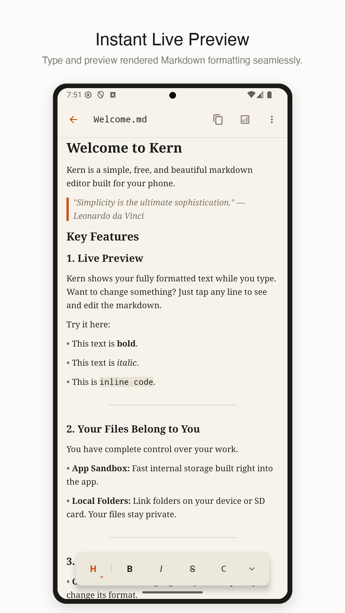

# Kern

Kern is an open-source Markdown editor for Android.

Write and edit Markdown on your phone, tablet, or foldable. Kern shows formatted text as you type and works with files in folders you choose.

[Website](https://attach.design/kern/) · [GitHub](https://github.com/iamkeeler/kern-android-markdown) · [Privacy policy](https://attach.design/kern/privacy.html)



## Why Kern

- **Live Markdown preview** — See headings, emphasis, lists, links, and code while you write.
- **Local files** — Open and edit files through Android’s file access system.
- **Readable editing** — Use clear typography, adjustable text size, themes, and focused editing views.
- **Writing tools** — Check word counts, reading grade level, sentence complexity, and other document metrics.
- **Large-screen layouts** — Use a file tree beside the editor on tablets and foldables.
- **Open source** — Read the code, follow development, and suggest changes on GitHub.

## Privacy

Kern does not host your documents or require an account. You choose where your files are stored.

Kern uses Firebase Analytics and Crashlytics. Its own analytics events record document opens, shares, and word and character counts. They do not include document titles, document text, or file paths. See the [privacy policy](https://attach.design/kern/privacy.html) for details.

## Project status

Kern is in active development. The Android app and website are being prepared for the first public Google Play release.

The current release work includes:

- final app and editor testing
- Play Store metadata and screenshots
- privacy and Data Safety review
- signed Android App Bundle releases

## Build locally

### Requirements

- JDK 17
- Android SDK Platform 36
- Android Build Tools 36.0.0 or newer

The real Firebase configuration is not tracked. Create a local configuration from the public template:

```bash
cp app/google-services.json.example app/google-services.json
```

Replace the placeholder values with your Firebase project configuration.

Run the test suite, lint, and release build:

```bash
./gradlew test lint bundleRelease
```

The release bundle is written to:

```text
app/build/outputs/bundle/release/app-release.aab
```

## Release automation

GitHub Actions handles release checks, Android App Bundle builds, Google Play uploads, and website deployment.

- `.github/workflows/release-readiness.yml` — tests, lint, and build checks
- `.github/workflows/google-play-release.yml` — signed Play releases
- `.github/workflows/deploy-website-ftp.yml` — website deployment
- `docs/release-automation.md` — required secrets and release steps

Sensitive files and credentials belong in GitHub Actions secrets. Never commit Firebase configuration, keystores, service-account files, tokens, or local properties.

## Contributing

Start with a focused issue or pull request. Good first contributions include bug fixes, documentation, tests, accessibility improvements, and release hardening.

Before opening a pull request, run:

```bash
./gradlew test lint bundleRelease
```

Read [CONTRIBUTING.md](CONTRIBUTING.md) for architecture and workflow rules.

## Security

Do not report security vulnerabilities in public issues. Email [gary@attach.design](mailto:gary@attach.design) with the affected version, steps to reproduce, and possible impact.

See [SECURITY.md](SECURITY.md) for the full reporting policy.

## License

Kern is released under the [Apache License 2.0](LICENSE).
